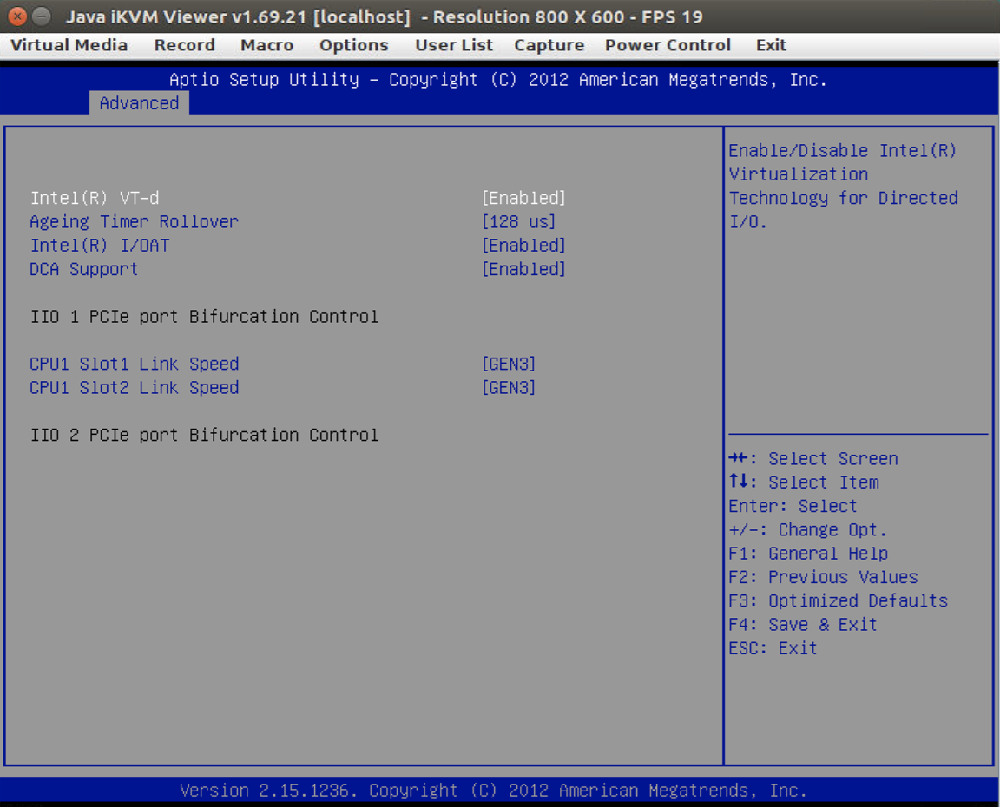

# Directvisor
Directvisor enables the direct interrupt delivery and PCI-device passthrough by VT-x and VT-d and supports the VM live migration. It is based on QEMU/KVM and ethernet bonding driver.

# Hardware Requirement
- Intel Virtualization Technology Extensions (VT-x).
- Intel Virtualization Technology for Directed I/O (VT-d).

# BIOS Configuration
Example: o40




# Pre-Requisite
- Linux 4.10.1 for both the host and guest.
- Our QEMU 4.1.0.
- VFIO.

# Kernel Parameters for Both Host and Guest
| Host Kernel Parameter | Description |
|-----------------------|-------------|
| intel_iommu=on  | Enable Intel IOMMU driver |
| intel_pstate=disable | Do not enable intel_pstate as the default scaling driver |
| intremap=no_x2apic_optout | BIOS x2APIC opt-out request will be ignored |
| isolcpus=1-n | Isolate CPUs from the general scheduler |
| lapic=notscdeadline | Use programmable the timer unit in LAPIC |
| nohz=off | Use a periodic timer |
| transparent_hugepage=madvise | Use ```madvise``` for transparent hugepages |
| nowatchdog | Disable both soft-lockup and NMI watchdog |
| rcupdate.rcu_cpu_stall_suppress=1 | Suppress RCU CPU stall warning messages |

| Guest Kernel Parameter | Description |
|------------------------|-------------|
| lapic=notscdeadline | Use programmable the timer unit in LAPIC |
| nohz=off | Use a periodic timer |
| transparent_hugepage=madvise | Use ```madvise``` for transparent hugepages |
| nowatchdog | Disable both soft-lockup and NMI watchdog |
| rcupdate.rcu_cpu_stall_suppress=1 | Suppress RCU CPU stall warning messages |
| console=ttyS0,115200n8 | Output to serial console |

# Install Linux Kernel 4.10.1
```
$ apt install gcc g++ make binutils bc libssl-dev
$ wget https://mirrors.edge.kernel.org/pub/linux/kernel/v4.x/linux-4.10.1.tar.gz
$ tar zxf linux-4.10.1.tar.gz
$ cd linux-4.10.1
$ touch .scmversion
$ make oldconfig
$ make -j $(nproc)
$ make -j $(nproc) INSTALL_MOD_STRIP=1 modules_install
$ make -j $(nproc) INSTALL_MOD_STRIP=1 install
$ reboot
```

# Install QEMU 4.1.0
```
$ apt install git libglib2.0-dev libfdt-dev libpixman-1-dev zlib1g-dev flex bison libnfs-dev libiscsi-dev libcap-dev libattr1-dev
$ git clone git@github.com:osnetsvn/qemu-4.1.0.git
$ cd qemu-4.1.0
$ git checkout origin/mvm -b mvm
$ ./configure --target-list=x86_64-softmmu --enable-virtfs
$ make -j $(nproc)
$ make -j $(nproc)
$ make -j $(nproc) install
```

# Install the Big Module in the Host
```
$ git clone git@github.com:osnetsvn/big.git
$ cd big
$ git checkout origin/mvm-4.10.1 -b mvm-4.10.1

# Since the KVM module is out of tree, 
# The out-of-tree KVM compilation requires the following changes in order to use the trace points. This is the restriction imposed by TRACE_INCLUDE_PATH. Full pathname for out-of-tree modules must be used.
# x86-kvm/trace.h
#   #define TRACE_INCLUDE_PATH /path/to/big/x86-kvm
# x86-kvm/mmutrace.h
#   #define TRACE_INCLUDE_PATH /path/to/big/x86-kvm

$ make
$ make remove
$ make insert
```

# Set up a Virtual Function
Example: Intel Corporation I350 Gigabit Network Controller
```
$ nvfs=1
$ interface="enp7s0f1"
$ echo $nvfs > /sys/class/net/$interface/device/sriov_numvfs
```

# Assign the Virtual Function to VFIO
```
$ modprobe vfio-pci

# example: device driver, bus/device/function and vendor:device of vf is igbvf, 0000:07:10.1 and 8086:1520, respectively.
$ echo "0000:07:10.1" > /sys/bus/pci/drivers/igbvf/unbind
$ echo "8086 1520" > /sys/bus/pci/drivers/vfio-pci/new_id
```

# Set up a Tap Device
```
$ sudo apt install uml-utilities
  
# assume the software bridge is configured.
$ br="br0"
$ tap="qtap0"
$ tunctl -t $tap -u `whoami`
$ brctl addif $br $tap
$ ifconfig $tap up
```

# Create a VCPU-PCPU Mapping
Example: map VCPU(0) to PCPU(1) and VCPU(1) to PCPU(2)
```
$ last=1
$ for i in `seq 0 $last`; do echo "$i $(( i + 1 ))"; done > map.txt
$ cat map.txt
0 1
1 2
```
For the second VM, we will do the same by specifying the mapping
differently. For example, the hypervisor would like to pass-through
PCPU(3) to VCPU(0), PCPU(4) to VCPU(1). 
Then,the file contains the following three records:
```
$ cat map.txt
0 3
1 4

```

# Boot up a VM
```
$ vcpu=2
$ memory="2G"
$ vm_image="vm.qcow2"
$ index=0
$ bdf="07:10.1"
$ cpumap="map.txt"

$ BASE=7000
$ tport=$(( BASE + index ))
$ mport=$(( 1000 + BASE + index ))
$ qsock="/tmp/qmp${index}.sock"
$ tap="qtap${index}"
$ octet=$(printf '%.2x\n' $(( ++index )))
$ mac="52:54:00:12:34:${octet}"

$ qemu-system-x86_64 \
          -enable-kvm \
          -cpu host,host-cache-info=on \
          -smp cpus=${vcpu},sockets=1,threads=1,maxcpus=${vcpu} \
          -m   ${memory} \
          -drive file=${vm_image},if=virtio \
          -device vfio-pci,host=${bdf},id=pnic \
          -osnet_cpumap path=${cpumap} \
          -qmp unix:${qsock},server,nowait \
          -serial telnet:127.0.0.1:${tport},server,nowait \
          -monitor telnet:127.0.0.1:${mport},server,nowait \
          -parallel none \
          -serial none \
          -net none \
          -vga none \
          -nographic \
          -nodefaults
#-netdev tap,ifname=$tap,id=$tap,script=no,downscript=no,vhost=on \
#-device virtio-net,netdev=$tap,mac=${mac},id=$tap \
```

# Pin VCPUs to PCPUs
Example: pin VCPU(0) to PCPU(1) and VCPU(1) to PCPU(2)
```
# get the vcpu thread ids
$ socket="/tmp/qmp0.sock"
$ echo '{"execute":"qmp_capabilities"}{"execute":"query-cpus"}' | nc -U ${socket} | tail -n 1 | tr ',{}[]' '\n' | awk '/thread_id/ {print $2}'
  
# example: vcpu(0) id is 1000 and vcpu(1) id is 1001
# example: pcpu(0) is 1 and pcpu(1) is 2
$ taskset -cp 1 1000
$ taskset -cp 2 1001
```

# Enable Direct Interrupt Delivery in the Guest
```
$ git clone git@github.com:osnetsvn/big.git
$ cd big
$ git checkout origin/guest -b guest
$ git checkout 81b75d8 -b guest-4.10.1
$ make
$ make insert
$ cd did
$ ./did.sh enable_did
```

# Disable Direct Interrupt Delivery in the Guest
```
$ cd big/did
$ ./did.sh disable_did
$ cd ..
$ make remove
```

# Verify Direct Timer Interrupt Delivery
- Since the guest controls the LAPIC timers, the timers should stop in the host, but continue to work in the guest. The number of timer interrupts stops incrementing in the host, while the number of timer interrupts increments in the guest.
  ```
  $ cat /proc/interrupts
  ```
# Measure the Network Performance
- Run the iperf server on the guest with DID enabled.
  ```
  iperf -s -i 1
  ```
- Run the iperf client on one of the clusters.
  ```
  # assume the VM's IP is 10.128.0.131.
  iperf -c 10.128.0.131 -t 10 -i 1
  ```

# Cyclictest
	Cyclictest will measure the timer latency.
- Clone the cyclictest repo
  ```
  $ git clone https://github.com/osnetsvn/cyclictest.git
  ```
- Compile and run the test
  ```
  $ cd cyclictest
  $ make
  $ mkdir trace
  $ ./kcyclictest.sh 1 20 hi
  ```
- View the test result
  ```
  $ cat /sys/kernel/debug/tracing/trace
  ```
- Clean the test result
  ```
  $ echo > /sys/kernel/debug/tracing/trace
  ```